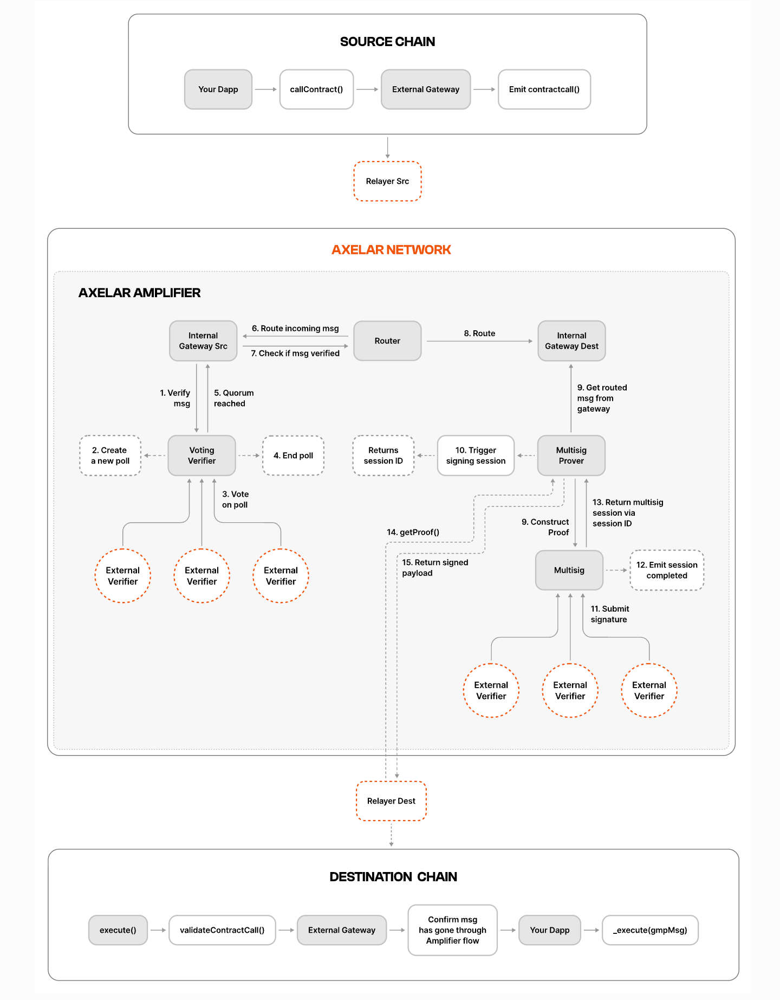

## 架构示意图

## Axelar 代码库及文档资源

Axelar 官方文档：
- 最重要的文档资源：[https://docs.axelar.dev/dev/intro](https://docs.axelar.dev/dev/intro)

智能合约（桥合约）：
- **Axelar Solidity SDK**: [https://github.com/axelarnetwork/axelar-cgp-solidity](https://github.com/axelarnetwork/axelar-cgp-solidity)
- 这是你需要在你自己的合约中导入的库。它提供了与 Axelar 网关交互的接口。
- 核心合约是 `IAxelarGateway` 和 `IAxelarGasService`。
- **预部署合约地址查询**：[https://docs.axelar.dev/dev/reference/testnet-contract-addresses](https://docs.axelar.dev/dev/reference/testnet-contract-addresses) （测试网）和 [https://docs.axelar.dev/dev/reference/mainnet-contract-addresses](https://docs.axelar.dev/dev/reference/mainnet-contract-addresses) （主网）。在这里你可以找到 Evmos、Arbitrum、Base 链上的 `Gateway` 和 `GasService` 合约地址：
- https://github.com/axelarnetwork/axelar-contract-deployments

浏览器：
- **Axelarscan**：[https://axelarscan.io/](https://axelarscan.io/) 用于追踪跨链交易状态。

JavaScript/TypeScript SDK：
 - **AxelarJS SDK**: [https://github.com/axelarnetwork/axelarjs-sdk](https://github.com/axelarnetwork/axelarjs-sdk)
 - 这个 SDK 非常有用，可以帮助你前端应用估算跨链 Gas 费、查询链状态、构造交易等。

示例代码库：
- **Axelar 示例**：[https://github.com/axelarnetwork/axelar-examples](https://github.com/axelarnetwork/axelar-examples)
- 这里面有非常完整的跨链代币转移（ERC-20）和通用消息传递（GMP）的示例代码，是你学习和开发的最佳起点。

## Hetu 开发网资源

- 开发环境 API：161.97.161.133:18545  
- NodeJS 服务框架：[https://github.com/hetu-project/hetu-tnservices-faucet](https://github.com/hetu-project/hetu-tnservices-faucet)
- 操作账号：`0xEFc9A81140D69Bafaa3D6B866a51818318EA645c`

## Base chain 相关资源

### 合约地址

- 测试网: [https://docs.axelar.dev/dev/reference/testnet-contract-addresses](https://docs.axelar.dev/dev/reference/testnet-contract-addresses)
- 主网：[https://docs.axelar.dev/dev/reference/mainnet-contract-addresses](https://docs.axelar.dev/dev/reference/mainnet-contract-addresses)

## Arbitum chain 资源

## 计划与排期
