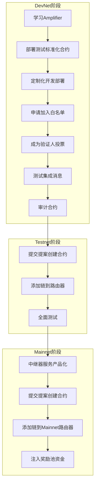

## 概述

Axelar bridge 目前提供了两种接入方式。针对 **EVM 兼容链**，推荐以 Interchain Amplifier 无许可方式接入，同时 Amplifier 方式默认支持 interchain-token-service (ITS) 协议，[文档参考]( https://docs.axelar.dev/dev/amplifier/introduction/ )。针对 **Cosmos IBC 链**，采用 Cosmos 技术栈的跨链通信协议 IBC 方式接入，IBC 接入需要两条链都做相应底层代码改动，故接入周期长，且不支持最新的 ITS 特性 [文档参考](https://docs.axelar.dev/resources/ibc-chain-onboarding/)。所以如下文档主要以 Interchain Amplifier 协议方式接入来介绍。相关概念请参考代码库及文档资源。

## 架构示意图

## 集成架构与流程

如下概述了将一条新区块链通过 **Interchain Amplifier** 接入 Axelar 网络所需的架构组件和集成流程。

#### 一、核心架构组件 (所需构建的合约与服务)

要将您的链连接到 Axelar 网络，您需要构建或实例化以下4个智能合约和1个中继服务：

1.  **源链网关合约 (Source Chain Gateway Contract)**
    *   **功能**：在您的链上部署的智能合约，是实现**跨链网关协议 (CCGP)** 的主要接口，供开发者从您的链发送消息。
    *   **说明**：对于 EVM 链，可以直接复用现有的 EVM 网关合约。

2.  **验证器合约 (Verifier Contract)**
    *   **功能**：部署在 **Axelar 网络** 上的合约，负责**验证您链上交易的有效性**。
    *   **说明**：大多数集成者可以从使用或定制**投票验证器 (Voting Verifier)** 开始，也可为特定用例（如零知识证明验证）进行自定义。

3.  **网关合约 (Gateway Contract)**
    *   **功能**：部署在 **Axelar 网络** 上的合约，它知道如何调用您的验证器合约来检查交易有效性，并知道如何将消息转发给 Amplifier 路由器。
    *   **说明**：此合约通常也可使用标准化版本进行定制。

4.  **证明器合约 (Prover Contract)**
    *   **功能**：部署在 **Axelar 网络** 上的合约，知道如何证明您链上交易的有效性。
    *   **说明**：大多数集成者可以从使用或定制**多签证明器 (multisig prover)** 开始。

5.  **消息中继器 (Message Relayer)**
    *   **功能**：一个后台服务，用于监听您链上的事件，并将这些事件（消息）**中继到 Axelar 网络**。
    *   **说明**：可以使用任何技术栈构建，Axelar 提供了示例中继器作为参考。

6.  **（可选）治理合约 (Governance Contract)**
    *   **功能**：一个部署在您链上的合约，用于接收来自 Axelar 网络的治理决策消息（例如，更新网关配置）。

7.  **（可选）Gas 表更新器 (Gas Table Updater)**
    *   **功能**：一个服务，用于更新 Axelar 网络上的 Gas 价格表，确保涉及您链的交易手续费估算准确。

### 集成流程 (Integration Process) 流程图

下图清晰地展示了将一条新链接入 Interchain Amplifier 的完整步骤，从学习测试到最终主网部署。

#### 开发网阶段

#### 流程关键点说明：

*   **循序渐进**：流程从开发网（DevNet）开始，经过测试网（Testnet）充分验证后，最终才部署到主网（Mainnet），确保安全可靠。
*   **治理提案**：将合约和链添加到 Axelar 网络是一个去中心化的治理过程，需要通过**链上提案**来完成，包括存储代码、实例化合约和添加路由。
*   **经济激励**：在主网阶段，需要为投票验证器和多签证明器的**奖励池注入资金**，以激励 Axelar 验证人为您链上的消息进行验证和签名，这是保障跨链安全的重要环节。

## 手续费支付
### [Transaction fees](https://docs.axelar.dev/dev/gas-service/pay-gas/#transaction-fees)

To simplify paying for transaction pricing through the pipeline, Axelar has two general solutions:

- For General Message Passing (function calls to `callContract()` or `callContractWithToken()`), a chain-agnostic relaying service is implemented to accept gas payments from users on the source chain in its native currency.
- For token transfers, a fixed “relayer fee” is deducted from the amount of assets being transferred cross-chain.

All costs can be seen on [Axelarscan](https://axelarscan.io/) by looking at a specific transaction — for example, [from Moonbeam to BNB Chain](https://axelarscan.io/gmp/0x598d35609919bc6c0737ae229af56b2135ccf5c1b031e1bd8d45f4ec4190e5a4:65).

## 代码库及文档资源
### Axelar 代码库及文档资源

Axelar 官方文档：
- 最重要的文档资源：[https://docs.axelar.dev/dev/intro](https://docs.axelar.dev/dev/intro)

智能合约（桥合约）：
- **Axelar Solidity SDK**: [https://github.com/axelarnetwork/axelar-cgp-solidity](https://github.com/axelarnetwork/axelar-cgp-solidity)
- 这是 Axelar 在不同区块链上部署的 **网关合约和协议**，同时也是你需要在你自己的合约中导入的库。它提供了与 Axelar 网关交互的接口。
- 核心合约是 `IAxelarGateway` 和 `IAxelarGasService`。
- **预部署合约地址查询**：[https://docs.axelar.dev/dev/reference/testnet-contract-addresses](https://docs.axelar.dev/dev/reference/testnet-contract-addresses) （测试网）和 [https://docs.axelar.dev/dev/reference/mainnet-contract-addresses](https://docs.axelar.dev/dev/reference/mainnet-contract-addresses) （主网）。在这里你可以找到 Evmos、Arbitrum、Base 链上的 `Gateway` 和 `GasService` 合约地址：
- https://github.com/axelarnetwork/axelar-contract-deployments

`axelar-amplifier` 放大器：

- **作用：** 这是一个更通用的 **跨链通信协议**，它超越了简单的代币桥接。它允许开发者在链之间发送任意数据和调用智能合约，而不仅仅是资产。同时也允许使用不同技术堆栈（Solidity、Rust 等）、共识机制（权益证明、L2s），而不仅限于 Cosmos 生态和 IBC 协议。

`interchain-token-service` (ITS) 协议：
- 它允许项目方或开发者创建一种**原生跨链代币（Interchain Token）**。
- 当您在 Hetu 上创建了一个 Interchain Token 后，您可以通过这个服务将其“部署”到 Base 和 Arbitrum 上。
- 在每一条链上，该代币都会有相同的代币地址和相同的合约行为。这消除了不同包装代币版本的问题。
- 所有这些代币版本都由 interchain-token-service 在后台进行管理和同步，确保无论代币在哪条链上，其总供应量和状态都保持一致。

浏览器：
- **Axelarscan**：[https://axelarscan.io/](https://axelarscan.io/) 用于追踪跨链交易状态。

JavaScript/TypeScript SDK：
 - **AxelarJS SDK**: [https://github.com/axelarnetwork/axelarjs-sdk](https://github.com/axelarnetwork/axelarjs-sdk)
 - 这个 SDK 非常有用，可以帮助你前端应用估算跨链 Gas 费、查询链状态、构造交易等。

示例代码库：
- **Axelar 示例**：[https://github.com/axelarnetwork/axelar-examples](https://github.com/axelarnetwork/axelar-examples)
- 这里面有非常完整的跨链代币转移（ERC-20）和通用消息传递（GMP）的示例代码，是你学习和开发的最佳起点。

### Hetu 开发网资源

- 开发环境 API：161.97.161.133:18545  
- NodeJS 服务框架：[https://github.com/hetu-project/hetu-tnservices-faucet](https://github.com/hetu-project/hetu-tnservices-faucet)
- 操作账号：`0xEFc9A81140D69Bafaa3D6B866a51818318EA645c`

### Base chain 相关资源

### 合约地址

- 测试网: [https://docs.axelar.dev/dev/reference/testnet-contract-addresses](https://docs.axelar.dev/dev/reference/testnet-contract-addresses)
- 主网：[https://docs.axelar.dev/dev/reference/mainnet-contract-addresses](https://docs.axelar.dev/dev/reference/mainnet-contract-addresses)
