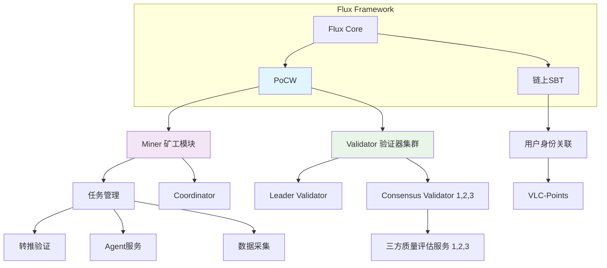

## Flux V1 框架概览

### 交付服务和SDK

- PoCW 服务：Miner 镜像，Validator 镜像，以及 Consensus 镜像
- SDK 估计没时间做，直接调用相关 API

### 外部第三方接口

- Miner：主要负责两种案例，数据提交类，服务提供类 (含 Agent)
	- 提供数据上传服务，不管数据采集 Miner 第三方自定义
	- 服务类型，直接上传服务返回的结果，服务/Agent 挖矿程序 第三方自定义
- Consensus Validator:
	- 主要需要暴露用于质量评估辅助程序，第三方自定义。
- SBT:
	- 第三方用户创建在 HPC 上关联创建 SBT 

### Notice
- 提供统一框架，暂不管已实现的业务。
  （例如现已实现的转推验证，需要按照 V1 版本方式进行集成实现方可使用）

## KEY 服务拆分

- POCW 主流程共识加验证投票（validator/ miner）
	- 拆分质量评估接口为单独的验证服务，需要绑定到 consensus validator
- 现在 Miner, Validator 均采用 IP 写死环境变量配置，需要改为服务注册方式进行配置
- 拆离跟转推任务相关验证逻辑和相对应的 consensus validator 验证逻辑。
	- 后续需要按照新方式进行集成
- User SBT Identity (SBT, Servers)  @东奇

## 合约实现

- Leader-Validator 身份管理合约
- SBT NFT Identity 合约已实现（复用）
- Points 合约（暂定，可能需要重构，或再设计）
- 其他 ？
