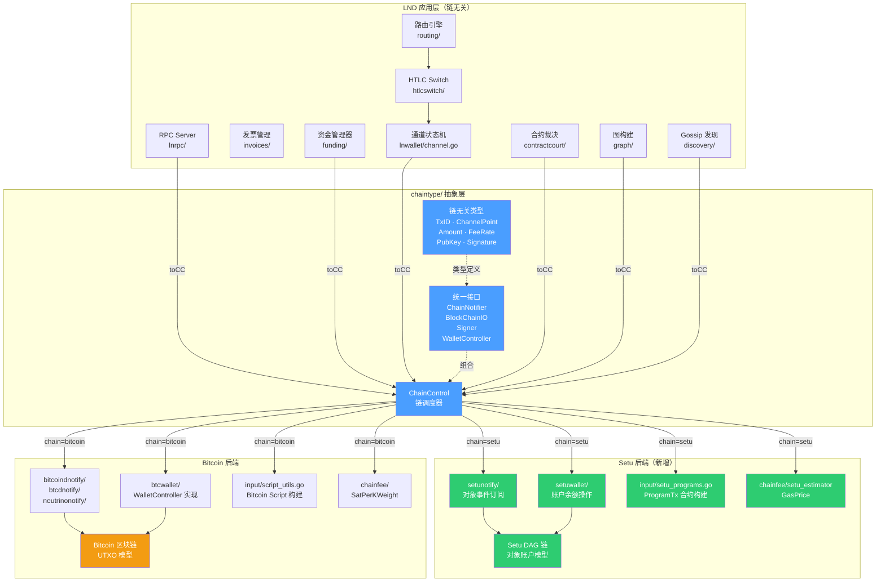
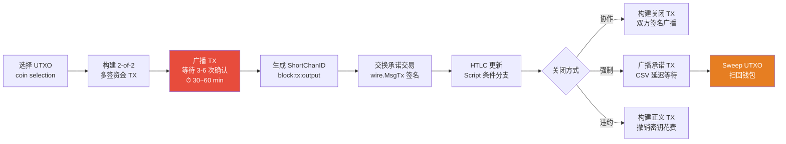
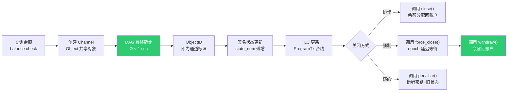
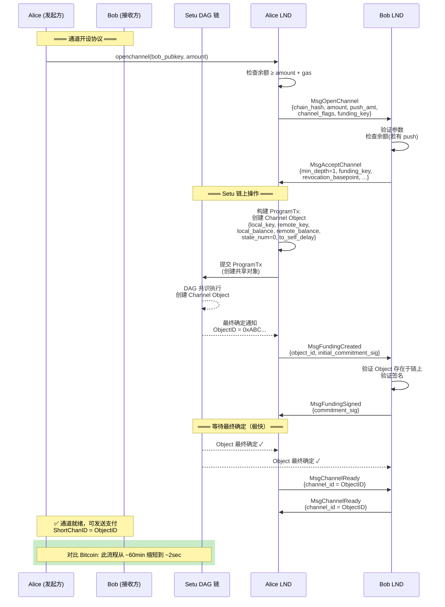
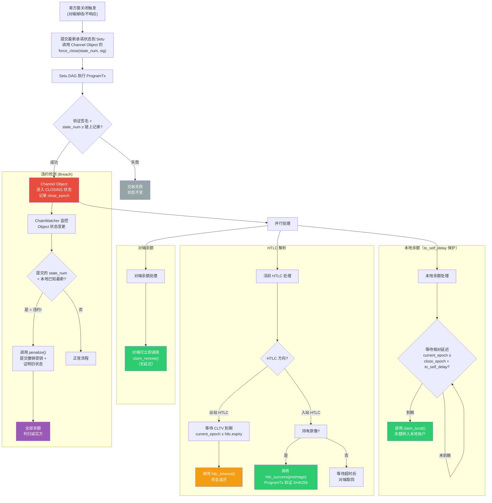
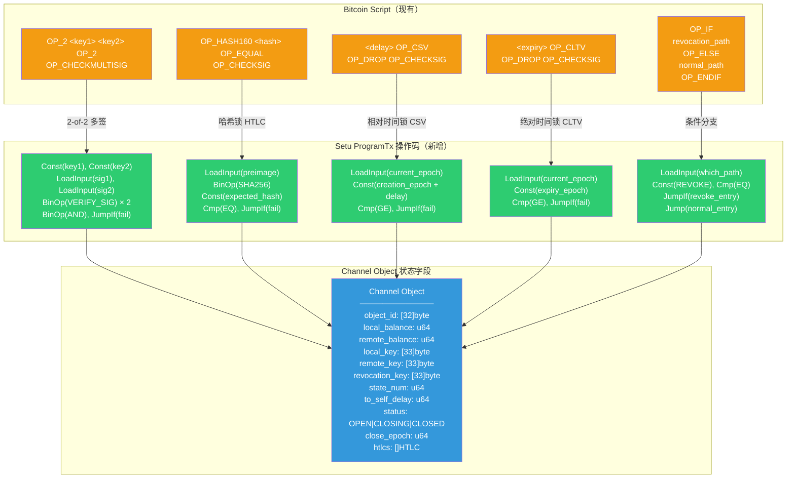
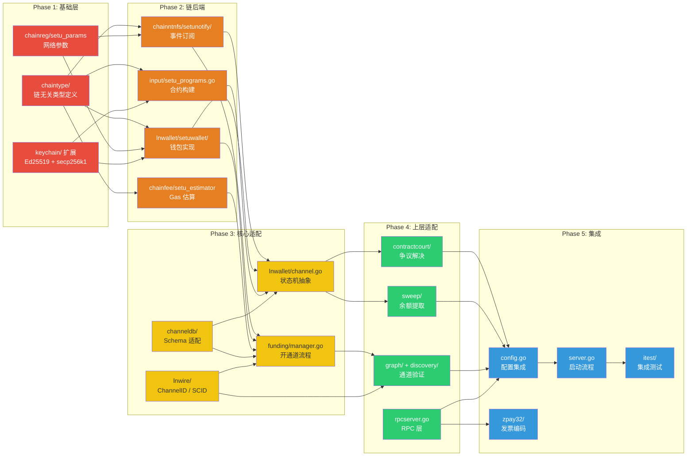

闪电网络适配 Setu or DAG 链 — 改造重构文档

<!-- more -->

## 0. Overview

将 LND 闪电网络改造为同时支持 **Bitcoin + Setu 双链**。Setu 是基于对象账户模型的 DAG 区块链，使用自定义 10 操作码解释器（`ProgramTx`）作为合约语言，密码学同时支持 secp256k1 和 Ed25519，通道以 32 字节 `ObjectID` 标识。改造策略：在现有 Bitcoin 类型之上引入**链无关抽象层**，Bitcoin 保留为一个实现，Setu 作为另一个实现插入，通过 `ChainControl` 做双链调度。

核心改造工作量分布：**新增抽象层（40%）→ Setu 后端实现（30%）→ 现有模块适配接口（20%）→ Setu 链上合约（10%）**。

---

## 1. 流程交互图

如下 7 张图分别覆盖了：

1. **架构总览** — 双链抽象层分层与模块关系
2. **通道生命周期对比** — Bitcoin vs Setu 的流程差异一目了然
3. **开通道序列** — 详细的双方+链交互时序
4. **多跳 HTLC 支付** — 正常流转与异常超时的完整序列
5. **强制关闭与争议解决** — 含违约惩罚的完整决策流程
6. **Script→ProgramTx 映射** — 每个 Bitcoin 操作码如何翻译为 Setu 10 操作码
7. **改造阶段依赖** — 5 个 Phase 的执行顺序与依赖
8. **链上/链下数据流全景** — 完整的通道生命周期交互泳道

### 1. 双链抽象架构总览

### 2. 通道生命周期对比（Bitcoin vs Setu）

- 图1：Bitcoin 闪电网络通道生命周期

- 图2：Setu 闪电网络通道生命周期

### 3. 开通道序列交互图（Setu 适配）

### 4. 多跳 HTLC 支付序列图

```mermaid
sequenceDiagram
    participant A as Alice<br/>(付款方)
    participant N1 as Node1<br/>(中继)
    participant B as Bob<br/>(收款方)
    participant Setu as Setu 链<br/>(仅争议时)

    Note over A, B: ═══ 发票创建 ═══
    B->>B: 生成 preimage R<br/>payment_hash H = SHA256(R)
    B->>A: Invoice (lnst1...)<br/>{H, amount, expiry_epoch}

    Note over A, B: ═══ 洋葱路由构建 ═══
    A->>A: 路径查找: A → N1 → B<br/>构建洋葱包 (Sphinx)

    Note over A, B: ═══ HTLC 转发链 ═══

    rect rgb(40, 50, 70)  # 替换为暗色主题适配的深蓝
        A->>N1: update_add_htlc<br/>{H, amt=1010, expiry=epoch+200}
        A->>N1: commitment_signed
        N1->>A: revoke_and_ack
        N1->>A: commitment_signed
        A->>N1: revoke_and_ack
        Note over A, N1: A↔N1 通道状态更新<br/>(链下签名交换，无链上操作)
    end

    rect rgb(40, 50, 70)  # 替换为暗色主题适配的深蓝
        N1->>B: update_add_htlc<br/>{H, amt=1000, expiry=epoch+100}
        N1->>B: commitment_signed
        B->>N1: revoke_and_ack
        B->>N1: commitment_signed
        N1->>B: revoke_and_ack
        Note over N1, B: N1↔B 通道状态更新<br/>(链下签名交换，无链上操作)
    end

    Note over A, B: ═══ 原像揭示（反向） ═══

    rect rgb(30, 60, 30)  # 替换为暗色主题适配的深绿
        B->>N1: update_fulfill_htlc<br/>{preimage=R}
        B->>N1: commitment_signed
        N1->>B: revoke_and_ack
        Note over N1, B: N1 获得 R，扣减 B 的 HTLC
    end

    rect rgb(30, 60, 30)  # 替换为暗色主题适配的深绿
        N1->>A: update_fulfill_htlc<br/>{preimage=R}
        N1->>A: commitment_signed
        A->>N1: revoke_and_ack
        Note over A, N1: A 确认支付完成
    end

    Note over A, B: ✅ 支付完成<br/>全程链下，零 gas 消耗

    Note over A, Setu: ═══ 异常情况：HTLC 超时 ═══

    rect rgb(70, 30, 30)  # 替换为暗色主题适配的深红
        alt B 不揭示原像且 expiry 到达
            N1->>Setu: 调用 htlc_timeout()<br/>ProgramTx: Cmp(current_epoch ≥ expiry)
            Setu-->>N1: HTLC 金额返还 N1
            N1->>A: update_fail_htlc
        end
    end
```

### 5. 强制关闭与争议解决流程图

### 6. Setu ProgramTx 合约逻辑映射图

### 7. 模块改造优先级与依赖关系

### 8. 数据流：链上 vs 链下交互全景

```mermaid
sequenceDiagram
    participant Alice
    participant Bob
    participant SetuChain as Setu Chain
    participant ChanObj as Channel Object

    Note over Alice, Bob: 🔵 链下（Lightning Protocol）
    Note over SetuChain, ChanObj: 🟠 链上（Setu DAG）

    Note over Alice, ChanObj: ══════ Phase 1: 通道建立 ══════

    Alice->>SetuChain: ProgramTx: create_channel<br/>{keys, balances, delay}
    SetuChain->>ChanObj: 创建 Shared Object<br/>state_num=0, status=OPEN
    SetuChain-->>Alice: ObjectID 确认
    SetuChain-->>Bob: ObjectID 确认

    Note over Alice, ChanObj: ══════ Phase 2: 链下支付（核心循环） ══════

    loop 每次支付/转发
        Alice->>Bob: update_add_htlc {hash, amt, expiry}
        Alice->>Bob: commitment_signed {sig_for_state_N+1}
        Bob->>Alice: revoke_and_ack {revocation_key_N}
        Bob->>Alice: commitment_signed {sig_for_state_N+1}
        Alice->>Bob: revoke_and_ack {revocation_key_N}
        Note over Alice, Bob: 双方本地更新状态<br/>state_num++ (无链上交互!)
    end

    Note over Alice, Bob: 💡 正常运行期间<br/>零链上交易，零 Gas

    Note over Alice, ChanObj: ══════ Phase 3a: 协作关闭 ══════

    Alice->>Bob: shutdown
    Bob->>Alice: shutdown
    Alice->>Bob: closing_signed {final_balances}
    Bob->>Alice: closing_signed {final_balances}

    Alice->>SetuChain: ProgramTx: cooperative_close<br/>{both_sigs, final_balances}
    SetuChain->>ChanObj: 验证双签名<br/>分配余额到各自账户
    SetuChain->>ChanObj: 销毁 Object → status=CLOSED

    Note over Alice, ChanObj: ══════ Phase 3b: 强制关闭（替代路径） ══════

    rect rgb(70, 30, 30)
        Alice->>SetuChain: ProgramTx: force_close<br/>{state_num, commitment_sig}
        SetuChain->>ChanObj: status → CLOSING<br/>close_epoch = current_epoch

        Note over Bob, ChanObj: Bob 有 to_self_delay 个 epoch<br/>检测是否为旧状态

        alt Bob 发现是旧状态（违约!）
            Bob->>SetuChain: ProgramTx: penalize<br/>{revocation_key, proof}
            SetuChain->>ChanObj: 全部余额判归 Bob
        else 状态正确，延迟到期后
            Alice->>SetuChain: ProgramTx: claim_local<br/>{epoch ≥ close_epoch + delay}
            Bob->>SetuChain: ProgramTx: claim_remote
            SetuChain->>ChanObj: 余额分别转入各自账户
        end
    end
```

## 2. 改造步骤

**1. 新增 `chaintype/` 包 — 链无关基础类型**

在项目根目录创建独立包，定义所有链无关的原始类型，替代 Bitcoin 特定类型在接口层的直接使用：

| 新类型                     | 替代                     | 说明                                                                |
| -------------------------- | ------------------------ | ------------------------------------------------------------------- |
| `chaintype.TxID`           | `chainhash.Hash`         | 32 字节交易/对象标识                                                |
| `chaintype.ChannelPoint`   | `wire.OutPoint`          | Bitcoin: `{TxID, Index}`；Setu: `ObjectID`                          |
| `chaintype.Amount`         | `btcutil.Amount`         | 统一金额类型（int64 最小单位）                                      |
| `chaintype.RawTx`          | `*wire.MsgTx`            | 字节序列化交易（链特定格式不透明传递）                              |
| `chaintype.Address`        | `btcutil.Address`        | 统一地址接口                                                        |
| `chaintype.PubKey`         | `*btcec.PublicKey`       | `[]byte`（secp256k1 33 字节 / Ed25519 32 字节）                     |
| `chaintype.Signature`      | `*ecdsa.Signature`       | `[]byte`（链特定编码）                                              |
| `chaintype.FeeRate`        | `chainfee.SatPerKWeight` | 抽象费率（Bitcoin: sat/kw, Setu: gas price）                        |
| `chaintype.BlockHeight`    | `uint32`                 | Bitcoin: 区块高度；Setu: epoch 编号                                 |
| `chaintype.ShortChannelID` | `lnwire.ShortChannelID`  | Bitcoin: 8 字节 block:tx:pos；Setu: ObjectID 哈希截断或直接 32 字节 |

同时定义 `chaintype.ChainID` 枚举标识当前链（`Bitcoin`/`Setu`），以及 `chaintype.Converter` 接口做不同链类型间的编解码。

**2. 重定义核心链后端接口**

修改以下接口使其使用 `chaintype.*` 而非 `wire.*`/`btcutil.*`。**保留现有 Bitcoin 实现**，通过包装器 (wrapper) 在 Bitcoin 侧做类型转换：

- **`ChainNotifier`** ([interface.go](vscode-file://vscode-app/Applications/Visual%20Studio%20Code.app/Contents/Resources/app/out/vs/code/electron-browser/workbench/workbench.html)) — `RegisterConfirmationsNtfn`/`RegisterSpendNtfn` 参数从 `*chainhash.Hash`/`*wire.OutPoint` 改为 `chaintype.TxID`/`chaintype.ChannelPoint`
- **`BlockChainIO`** ([interface.go:567-597](vscode-file://vscode-app/Applications/Visual%20Studio%20Code.app/Contents/Resources/app/out/vs/code/electron-browser/workbench/workbench.html)) — `GetBestBlock`/`GetUtxo`/`GetBlock` 返回值抽象化
- **`Signer`** ([signer.go](vscode-file://vscode-app/Applications/Visual%20Studio%20Code.app/Contents/Resources/app/out/vs/code/electron-browser/workbench/workbench.html)) — `SignOutputRaw`/`ComputeInputScript` 参数从 `*wire.MsgTx` 改为 `chaintype.RawTx` + 抽象 `SignRequest`
- **`WalletController`** ([interface.go:230-563](vscode-file://vscode-app/Applications/Visual%20Studio%20Code.app/Contents/Resources/app/out/vs/code/electron-browser/workbench/workbench.html)) — 这是最大挑战；策略是拆分为**通用钱包接口**（余额查询、转账、地址生成）+ **链特有扩展接口**（Bitcoin: PSBT/UTXO 操作；Setu: 对象操作）

**3. 扩展 `ChainControl` 为链调度器**

修改 [chainregistry.go:193-220](vscode-file://vscode-app/Applications/Visual%20Studio%20Code.app/Contents/Resources/app/out/vs/code/electron-browser/workbench/workbench.html) 中的 `ChainControl` 结构体：

- 新增 `ChainType chaintype.ChainID` 字段
- 在 [chainregistry.go:266-350](vscode-file://vscode-app/Applications/Visual%20Studio%20Code.app/Contents/Resources/app/out/vs/code/electron-browser/workbench/workbench.html) 的 switch 语句中新增 `"setu"` 分支
- 创建 chainreg/setu_params.go 定义 `SetuNetParams`（网络 ID、创世哈希、默认端口、epoch 间隔）
- 修改 [config.go:249](vscode-file://vscode-app/Applications/Visual%20Studio%20Code.app/Contents/Resources/app/out/vs/code/electron-browser/workbench/workbench.html) 新增 `SetuChainName = "setu"` 和 `Setu *lncfg.Chain` 配置项

**4. 实现 Setu 链通知后端 `chainntnfs/setunotify/`**

实现 `ChainNotifier` 接口，核心映射关系：

| Bitcoin 概念                                | Setu 实现                                           |
| ------------------------------------------- | --------------------------------------------------- |
| `RegisterConfirmationsNtfn(txid, numConfs)` | 订阅对象最终确定事件（DAG 最终性通常 1 次确认即可） |
| `RegisterSpendNtfn(outpoint)`               | 订阅 Channel Object 状态变更（余额变化/对象销毁）   |
| `RegisterBlockEpochNtfn()`                  | 订阅 Setu epoch 推进事件                            |
| 区块重组检测                                | 大幅简化（DAG 无经典重组）                          |
| `GetBlock()` / `GetBlockHash()`             | 查询 epoch 信息 / DAG 轮次数据                      |

**5. 实现 Setu 钱包 `lnwallet/setuwallet/`**

实现适配后的 `WalletController` 接口：

| Bitcoin 操作                           | Setu 操作                                                     |
| -------------------------------------- | ------------------------------------------------------------- |
| `ListUnspentWitness()` — 列出 UTXO     | `GetBalance()` — 查询账户余额                                 |
| `LeaseOutput(OutPoint)` — 锁 UTXO      | `ReserveBalance(amount)` — 预留余额                           |
| `SendOutputs([]*wire.TxOut)` — 构建 TX | `Transfer(to, amount)` — 调用转账                             |
| `FundPsbt()` / `SignPsbt()`            | `BuildProgramTx()` / `SignProgramTx()` — 构建 Setu 可编程交易 |
| 币选择（`selectInputs`）               | 不需要（直接从余额扣减）                                      |
| 找零地址生成                           | 不需要                                                        |

密钥管理方面：复用 [derivation.go](vscode-file://vscode-app/Applications/Visual%20Studio%20Code.app/Contents/Resources/app/out/vs/code/electron-browser/workbench/workbench.html) 的 `KeyFamily` 体系，新增 Setu coinType，密钥衍生支持 secp256k1 和 Ed25519 双路径。

**6. Setu 链上脚本合约 — 基于 10 操作码解释器**

基于 Setu 的 `ProgramTx` 和 `{Nop, Const, Mov, BinOp, Cmp, LoadInput, StoreOutput, Jump, JumpIf, Halt}` 操作码，实现以下闪电网络核心合约逻辑：

**6a. 通道资金合约（Channel Funding Program）**：

- 使用 `Const` + `Cmp` + `JumpIf` 实现双方签名验证分支
- `LoadInput` 加载签名数据，`BinOp` 做哈希计算
- 对象字段存储：`local_balance`, `remote_balance`, `local_key`, `remote_key`, `state_num`

**6b. HTLC 合约程序**：

- 三路径分支（`JumpIf`）：① 原像解锁（`BinOp` 做 SHA256 比较）② 超时回收（`Cmp` 比较当前 epoch）③ 撤销惩罚（签名验证）
- `LoadInput` 从交易输入加载原像/签名
- `StoreOutput` 写入余额变更

**6c. 时间锁实现**：

- **相对时间锁（CSV 等价）**：`LoadInput(current_epoch)` → `Const(creation_epoch + delay)` → `Cmp` → `JumpIf(fail)`
- **绝对时间锁（CLTV 等价）**：`LoadInput(current_epoch)` → `Const(expiry_epoch)` → `Cmp` → `JumpIf(fail)`

**6d. 撤销/惩罚机制**：

- 对象状态中存储 `revocation_key`
- 若检测到旧状态广播，持有撤销密钥的一方可调用惩罚入口（通过签名验证分支）

在 Go 侧创建 `input/setu_programs.go`，封装上述合约的构建函数（等价于现有 [script_utils.go](vscode-file://vscode-app/Applications/Visual%20Studio%20Code.app/Contents/Resources/app/out/vs/code/electron-browser/workbench/workbench.html) 的 3275 行 Bitcoin Script 构建）。

**7. 通道标识体系重设计**

- 修改 [channel_id.go](vscode-file://vscode-app/Applications/Visual%20Studio%20Code.app/Contents/Resources/app/out/vs/code/electron-browser/workbench/workbench.html) — `NewChanIDFromOutPoint` 在 Setu 链上直接使用 ObjectID 的前 32 字节，无需 XOR 变换
- 修改 [short_channel_id.go](vscode-file://vscode-app/Applications/Visual%20Studio%20Code.app/Contents/Resources/app/out/vs/code/electron-browser/workbench/workbench.html) — Setu 模式下 `ShortChannelID` 使用 ObjectID（32 字节）。路由协议消息中的编码需扩展为变长或使用 TLV 扩展字段承载完整 ObjectID
- 更新 [channel.go](vscode-file://vscode-app/Applications/Visual%20Studio%20Code.app/Contents/Resources/app/out/vs/code/electron-browser/workbench/workbench.html) — `FundingOutpoint` 字段改为 `chaintype.ChannelPoint`，数据库 schema 需支持 Bitcoin OutPoint 和 Setu ObjectID 两种格式的序列化
- 修改 [channel_edge_info.go](vscode-file://vscode-app/Applications/Visual%20Studio%20Code.app/Contents/Resources/app/out/vs/code/electron-browser/workbench/workbench.html) — `BitcoinKey1Bytes`/`BitcoinKey2Bytes` 重命名为 `ChainKey1Bytes`/`ChainKey2Bytes`，或保留 Bitcoin 字段并新增 `SetuKey1Bytes`/`SetuKey2Bytes`

**8. 通道状态机适配**

[channel.go](vscode-file://vscode-app/Applications/Visual%20Studio%20Code.app/Contents/Resources/app/out/vs/code/electron-browser/workbench/workbench.html)（10185 行）的改造策略是**分离协议逻辑与链上操作**：

- 提取接口 `CommitmentBuilder`：Bitcoin 实现构建 `wire.MsgTx` 承诺交易，Setu 实现构建 `ProgramTx` 状态更新
- 提取接口 `ScriptEngine`：Bitcoin 实现使用 `txscript` 验证/构建脚本，Setu 实现使用 10 操作码解释器
- 修改 [commitment.go](vscode-file://vscode-app/Applications/Visual%20Studio%20Code.app/Contents/Resources/app/out/vs/code/electron-browser/workbench/workbench.html) — `CommitmentKeyRing` 的密钥衍生保留通用逻辑，签名/验证委托给 `Signer` 接口
- 保留状态编号（`StateNum`）、HTLC 管理（`UpdateLog`）、撤销密钥交换（[shachain](vscode-file://vscode-app/Applications/Visual%20Studio%20Code.app/Contents/Resources/app/out/vs/code/electron-browser/workbench/workbench.html)）的核心来协议逻辑不变

**9. 资金管理器适配**

修改 [manager.go](vscode-file://vscode-app/Applications/Visual%20Studio%20Code.app/Contents/Resources/app/out/vs/code/electron-browser/workbench/workbench.html)：

- `waitForFundingConfirmation` — Setu 模式下等待 DAG 最终确定（1 次确认），大幅缩短超时
- 资金交易构建从 `chanfunding.WalletAssembler`（UTXO 选择）切换到新的 `chanfunding.SetuAssembler`（直接创建 Channel Object + 余额锁定）
- `ShortChannelID` 生成逻辑：Bitcoin 等待在区块中确认后编码位置；Setu 在对象创建最终确定后使用 ObjectID

**10. 合约裁决适配**

修改 [contractcourt](vscode-file://vscode-app/Applications/Visual%20Studio%20Code.app/Contents/Resources/app/out/vs/code/electron-browser/workbench/workbench.html) 所有 resolver：

- `commitSweepResolver` — Setu: 调用 Channel Object 的 `claim_local_balance` 入口
- `htlcTimeoutResolver` — Setu: 调用 HTLC 的 `timeout_claim` 入口（等待 epoch 到期）
- `htlcSuccessResolver` — Setu: 调用 HTLC 的 `preimage_claim` 入口
- `breachArbitrator` — Setu: 调用 Channel Object 的 `penalize` 入口（提交撤销密钥 + 旧状态证明）
- `anchorResolver` — Setu: **不需要**（DAG 无需费率提升机制）
- 修改 [channel_arbitrator.go](vscode-file://vscode-app/Applications/Visual%20Studio%20Code.app/Contents/Resources/app/out/vs/code/electron-browser/workbench/workbench.html) 检测对象状态变更而非 UTXO 花费

**11. Sweep 模块简化**

在 [sweep](vscode-file://vscode-app/Applications/Visual%20Studio%20Code.app/Contents/Resources/app/out/vs/code/electron-browser/workbench/workbench.html) 中新增 Setu 模式：

- 移除 Bitcoin 特有的交易构建 (`wire.NewMsgTx`)、权重估算、RBF/CPFP 逻辑
- Setu 上的"扫回"简化为：调用 Channel Object 的 `withdraw` 函数将余额转回个人账户
- `FeeRate` 从 `SatPerKWeight` 改为 `chaintype.FeeRate`（Setu: gas price）
- 批量聚合优化在 Setu 上用处不大（每次调用成本低于 Bitcoin TX）

**12. 图与发现适配**

- 修改 [builder.go](vscode-file://vscode-app/Applications/Visual%20Studio%20Code.app/Contents/Resources/app/out/vs/code/electron-browser/workbench/workbench.html) — 通道存活性检查：Bitcoin 检查 UTXO 集合；Setu 查询 Channel Object 是否仍存在于状态树（SMT 查询）
- 修改 [gossiper.go](vscode-file://vscode-app/Applications/Visual%20Studio%20Code.app/Contents/Resources/app/out/vs/code/electron-browser/workbench/workbench.html) — 通道验证：Bitcoin 验证链上 2-of-2 多签脚本；Setu 验证 Channel Object 存在 + 双方 key 匹配 + SMT Merkle 证明
- `chanvalidate/` 新增 Setu 验证逻辑

**13. 费率体系适配**

- 在 [chainfee](vscode-file://vscode-app/Applications/Visual%20Studio%20Code.app/Contents/Resources/app/out/vs/code/electron-browser/workbench/workbench.html) 中新增 `SetuEstimator` 实现 `Estimator` 接口
- Bitcoin: `EstimateFeePerKW(numBlocks)` → Setu: `EstimateGasPrice(priority)`
- 修改 [rates.go](vscode-file://vscode-app/Applications/Visual%20Studio%20Code.app/Contents/Resources/app/out/vs/code/electron-browser/workbench/workbench.html) — 新增 `GasPrice` 类型和转换方法
- 移除 Setu 模式下的 dust 限制检查（账户模型无 dust 概念）

**14. RPC 与发票适配**

- 修改 [rpcserver.go](vscode-file://vscode-app/Applications/Visual%20Studio%20Code.app/Contents/Resources/app/out/vs/code/electron-browser/workbench/workbench.html) 中的 `GetInfo` — 根据 `ChainType` 返回 `"bitcoin"` 或 `"setu"`
- 钱包 RPC（`SendCoins`、`NewAddress`、`ListUnspent`）需按链类型调度
- 修改 [zpay32](vscode-file://vscode-app/Applications/Visual%20Studio%20Code.app/Contents/Resources/app/out/vs/code/electron-browser/workbench/workbench.html) — 新增 Setu HRP（如 `lnst` 主网、`lnsts` 测试网）
- 金额单位在 proto 定义中保持为最小单位整数，由客户端解释

**15. 配置与启动**

- 修改 [config.go](vscode-file://vscode-app/Applications/Visual%20Studio%20Code.app/Contents/Resources/app/out/vs/code/electron-browser/workbench/workbench.html) — 新增 `Setu *lncfg.Chain`、`SetuMode *lncfg.SetuNode`
- 新增 lncfg/setu.go — Setu 节点配置（RPC 地址、SDK 路径等）
- 修改 [config_builder.go](vscode-file://vscode-app/Applications/Visual%20Studio%20Code.app/Contents/Resources/app/out/vs/code/electron-browser/workbench/workbench.html) — `BuildChainControl` 新增 Setu 分支
- 修改 [server.go](vscode-file://vscode-app/Applications/Visual%20Studio%20Code.app/Contents/Resources/app/out/vs/code/electron-browser/workbench/workbench.html) — 根据链类型初始化对应子系统

---

## 3. Setu 链必须支持的完整能力清单

### P0 — 核心能力（无此能力则无法运行闪电网络）

| #   | 能力                         | 详细需求                                                                  | 对应 LND 模块                                                                                                                                                        |
| --- | ---------------------------- | ------------------------------------------------------------------------- | -------------------------------------------------------------------------------------------------------------------------------------------------------------------- |
| 1   | **可编程交易 (ProgramTx)**   | 10 操作码解释器需支持：条件分支、哈希比较、签名验证、epoch 比较、状态读写 | `input/setu_programs.go`                                                                                                                                             |
| 2   | **共享对象 (Shared Object)** | Channel Object 需双方都能操作；状态更新需双方签名授权                     | `lnwallet/setuwallet/`                                                                                                                                               |
| 3   | **哈希锁 (Hashlock)**        | `BinOp` 操作码需支持 SHA256，`Cmp` 需支持字节数组/哈希比较                | HTLC 合约                                                                                                                                                            |
| 4   | **Epoch 级时间查询**         | `LoadInput` 能加载当前 epoch 编号，合约可据此做时间锁判断                 | CSV/CLTV 等价                                                                                                                                                        |
| 5   | **对象版本/序列号**          | Channel Object 需有单调递增的 `state_num`，防止旧状态重放                 | 承诺交易序号                                                                                                                                                         |
| 6   | **事件订阅 API**             | 按 ObjectID 订阅状态变更事件（创建、更新、销毁）；epoch 推进事件          | `chainntnfs/setunotify/`                                                                                                                                             |
| 7   | **最终性通知**               | 交易提交后能回调通知最终确定状态                                          | [manager.go](vscode-file://vscode-app/Applications/Visual%20Studio%20Code.app/Contents/Resources/app/out/vs/code/electron-browser/workbench/workbench.html) 确认流程 |
| 8   | **多签名验证**               | `ProgramTx` 中能验证 2-of-2 签名（secp256k1 ECDSA 或 Ed25519）            | 资金输出 2-of-2                                                                                                                                                      |
| 9   | **对象查询 API**             | 按 ObjectID 查询完整对象状态（余额、密钥、HTLC 列表等）                   | `BlockChainIO` 等价                                                                                                                                                  |
| 10  | **原子性状态更新**           | 合约执行的状态变更要么全部生效、要么全部回滚                              | 通道状态一致性                                                                                                                                                       |
| 11  | **密钥管理 SDK**             | Go SDK 支持 secp256k1 和 Ed25519 密钥对生成、HD 衍生、签名、验证          | [keychain](vscode-file://vscode-app/Applications/Visual%20Studio%20Code.app/Contents/Resources/app/out/vs/code/electron-browser/workbench/workbench.html)            |
| 12  | **交易构建与广播 SDK**       | Go SDK 支持编程构建 `ProgramTx`、签名、提交到网络                         | `lnwallet/setuwallet/`                                                                                                                                               |

### P1 — 重要能力（影响安全性和可扩展性）

| #   | 能力                        | 详细需求                                                 | 对应 LND 模块                                                                                                                                                          |
| --- | --------------------------- | -------------------------------------------------------- | ---------------------------------------------------------------------------------------------------------------------------------------------------------------------- |
| 13  | **Merkle 证明 (SMT Proof)** | 提供对象存在性/不存在性的 Binary+Sparse Merkle Tree 证明 | [discovery](vscode-file://vscode-app/Applications/Visual%20Studio%20Code.app/Contents/Resources/app/out/vs/code/electron-browser/workbench/workbench.html) 通道验证    |
| 14  | **历史状态查询**            | 按 epoch 查询 Channel Object 的历史状态（用于争议仲裁）  | [contractcourt](vscode-file://vscode-app/Applications/Visual%20Studio%20Code.app/Contents/Resources/app/out/vs/code/electron-browser/workbench/workbench.html)         |
| 15  | **Gas 估算 API**            | 估算 `ProgramTx` 执行的 gas 消耗                         | `chainfee/`                                                                                                                                                            |
| 16  | **批量操作**                | 单笔交易中原子性地操作多个对象（批量 HTLC 结算）         | [sweep](vscode-file://vscode-app/Applications/Visual%20Studio%20Code.app/Contents/Resources/app/out/vs/code/electron-browser/workbench/workbench.html) 批量处理        |
| 17  | **对象销毁通知**            | Channel Object 被销毁时（通道关闭）生成可订阅事件        | [builder.go](vscode-file://vscode-app/Applications/Visual%20Studio%20Code.app/Contents/Resources/app/out/vs/code/electron-browser/workbench/workbench.html) 通道存活性 |
| 18  | **节点发现/P2P**            | Setu 网络节点的 P2P 连接信息（用于 LN gossip 引导）      | [chainreg](vscode-file://vscode-app/Applications/Visual%20Studio%20Code.app/Contents/Resources/app/out/vs/code/electron-browser/workbench/workbench.html) DNS 种子     |

### P2 — 优化能力（提升性能和用户体验）

| #   | 能力                | 详细需求                                                         |
| --- | ------------------- | ---------------------------------------------------------------- |
| 19  | **轻客户端模式**    | 类似 Neutrino 的 Setu 轻节点（仅验证 Merkle 证明，不存全量状态） |
| 20  | **Watchtower 支持** | 第三方可监控 Channel Object 状态并在违约时自动提交惩罚交易       |
| 21  | **原子跨链操作**    | 支持 Bitcoin↔Setu 的原子交换/跨链 HTLC（如果需要双链互操作）     |

---

## 4. 验证

- **单元测试**: 每个新增的 Setu 实现（`setunotify/`、`setuwallet/`、`setu_programs.go`）独立测试，mock Setu SDK
- **集成测试**: 修改 [itest](vscode-file://vscode-app/Applications/Visual%20Studio%20Code.app/Contents/Resources/app/out/vs/code/electron-browser/workbench/workbench.html) 框架，新增 Setu devnet backend，覆盖核心场景：
  - 开通道 → 发送支付 → 多跳转发 → 协作关闭
  - 单方面关闭 → HTLC 超时/成功解析
  - 违约检测 → 惩罚交易
  - 双链模式：Bitcoin 和 Setu 通道共存
- **命令**: `make itest backend=setu` 或 `go test -tags setu [lnd](http://_vscodecontentref_/118).`
- **手动检查**: `lncli --chain=setu getinfo`、`lncli --chain=setu openchannel`

## 5. 决策记录

- **密码学**: 双支持 secp256k1 + Ed25519（同 Sui），[keychain](vscode-file://vscode-app/Applications/Visual%20Studio%20Code.app/Contents/Resources/app/out/vs/code/electron-browser/workbench/workbench.html) 需扩展双路径衍生
- **双链支持**: 保留 Bitcoin，通过接口抽象 + `ChainControl` 调度同时支持 Setu
- **合约语言**: Setu 自定义 10 操作码解释器（`ProgramTx`），非 Move/EVM — 需精心设计操作码序列实现 HTLC/时间锁/撤销逻辑
- **通道 ID**: Setu 上使用 32 字节 ObjectID 直接标识通道，路由协议消息中通过 TLV 扩展承载
